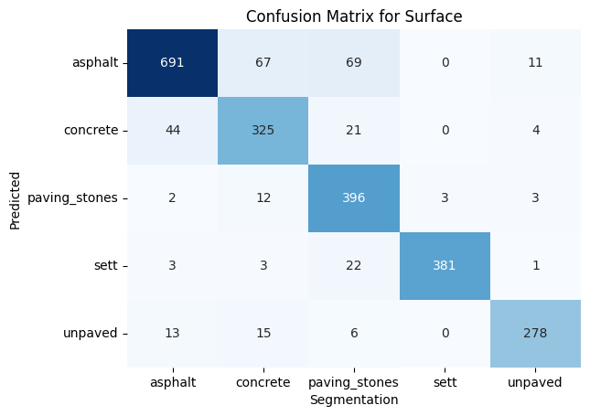
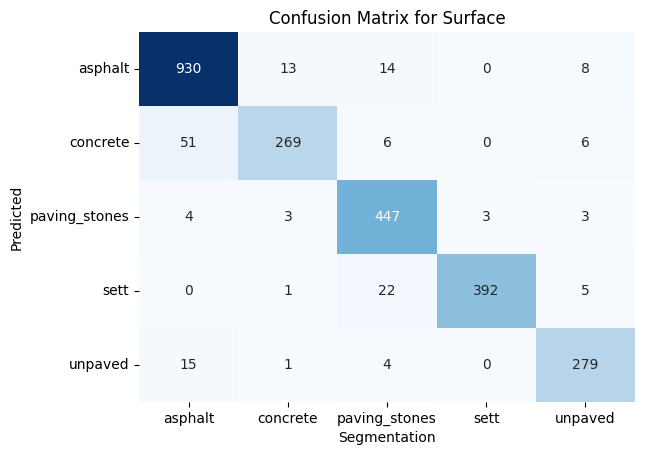
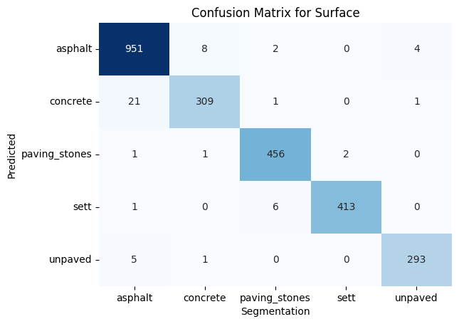

# Segmentation analysis

## V9

Comparison: V9 (train-cropping) vs V9 (largest segment in train-cropping + masking + train-cropping)

Detection values:

```python
'construction--flat--road': (255, 0, 0), # red
'construction--flat--bike-lane': (0, 255, 0), # green
'construction--flat--sidewalk': (0, 0, 255), # blue
'construction--flat--crosswalk-plain': (255, 255, 0), # yellow
'construction--flat--curb-cut': (255, 0, 255), # pink
'construction--flat--driveway': (255, 0, 255), # pink
'construction--flat--parking': (255, 0, 255), # pink
'construction--flat--parking-aisle': (255, 0, 255), # pink
'construction--flat--pedestrian-area': (255, 0, 255), # pink
'construction--flat--rail-track': (255, 0, 255), # pink
'construction--flat--road-shoulder': (255, 0, 255), # pink
'construction--flat--service-lane': (255, 0, 255), # pink
'construction--flat--traffic-island': (255, 0, 255), # pink
'void--ground': (0, 255, 255), # turquoise
'void--unlabeled': (0, 255, 255), # turquoise
'void--static': (0, 255, 255), # turquoise
'nature--beach': (127, 0, 255), # lilac
'nature--sand': (127, 0, 255), # lilac
'nature--snow': (127, 0, 255), # lilac
'nature--terrain': (127, 0, 255), # lilac
'nature--vegetation': (127, 0, 255), # lilac
'nature--water': (127, 0, 255), # lilac
```

Model: surface-efficientNetV2SLinear-20240318_114422-a68tf9lt_epoch4.pt (all-trained)

Predictions:
- training: all_train_effnet_surface_quality_prediction-V9_annotated-20240318_130115
- segmentation: all_train_effnet_surface_quality_prediction-V9_annotated-20240403_181456

Analysis CSV: V9/metadata/model_predictions/...
- seg_correct_surface_comments
- seg_mis_surface_comments
- seg_mis_surface_prob

Evaluation:

Images with segmentation
- Count: 2370
- Precision: 0.88
- Recall: 0.87




## V11

Comparison: V11 (train-cropping) vs V9 (largest segment in train-cropping + masking + mask-cropping)

Detection values:

```python
'construction--flat--road': (255, 0, 0), # red
'construction--flat--bike-lane': (0, 255, 0), # green
'construction--flat--sidewalk': (0, 0, 255), # blue
'construction--flat--crosswalk-plain': (255, 255, 0), # yellow
'construction--flat--curb-cut': (255, 0, 255), # pink
'construction--flat--driveway': (255, 0, 255), # pink
'construction--flat--parking': (255, 0, 255), # pink
'construction--flat--parking-aisle': (255, 0, 255), # pink
'construction--flat--pedestrian-area': (255, 0, 255), # pink
'construction--flat--rail-track': (255, 0, 255), # pink
'construction--flat--road-shoulder': (255, 0, 255), # pink
'construction--flat--service-lane': (255, 0, 255), # pink
'construction--flat--traffic-island': (255, 0, 255), # pink
'void--ground': (0, 255, 255), # turquoise
'void--unlabeled': (0, 255, 255), # turquoise
'void--static': (0, 255, 255), # turquoise
'nature--beach': (127, 0, 255), # lilac
'nature--sand': (127, 0, 255), # lilac
'nature--snow': (127, 0, 255), # lilac
'nature--terrain': (127, 0, 255), # lilac
# 'nature--vegetation': (127, 0, 255), # lilac
'nature--water': (127, 0, 255), # lilac
```

Model: surface-efficientNetV2SLinear-20240408_135216-sd61xphn_epoch5.pt

Predictions:
- training: effnet_surface_prediction-V11_annotated-20240408_143707
- segmentation: effnet_surface_prediction_mask_crop-V11_annotated-20240408_202157

Analysis CSV: V9/metadata/model_predictions/...
- seg_mis_surface_mask_crop
- seg_correct_surface_mask_crop

Evaluation:

Images with segmentation
- Count: 2476
- Precision: 0.95
- Recall: 0.95


Comparison 2: V11 (train-cropping) vs V9 (largest segment in train-cropping + masking + train-cropping)

Predictions:
- training: effnet_surface_prediction-V11_annotated-20240408_143707
- segmentation: effnet_surface_prediction_mask-V11_annotated-20240409_163537

Analysis CSV: V9/metadata/model_predictions/...
- seg_mis_surface_mask
- seg_correct_surface_mask

Evaluation:

Images with segmentation
- Count: 2476
- Precision: 0.94
- Recall: 0.94



Comparison 3: V11 (train-cropping) vs V9 (largest segment in train-cropping + mask-cropping)

Predictions:
- training: effnet_surface_prediction-V11_annotated-20240408_143707
- segmentation: effnet_surface_prediction_crop-V11_annotated-20240410_120029

Analysis CSV: V9/metadata/model_predictions/...
- seg_mis_surface_crop
- seg_correct_surface_crop

Evaluation:

Images with segmentation
- Count: 2476
- Precision: 0.98
- Recall: 0.98

